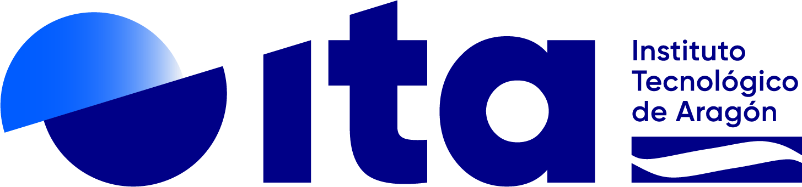

<p align="left">
  
  
</p>

This repository contains scripts, utilities, and a modular pipeline to produce **Analysis Ready Data** (ARD) from satellite and airborne imagery. The main goal is to streamline the transition from raw data (**L1**) through various pre-processing and processing stages (**L2**, **L3**, **L4**) to reach advanced insights, such as semantic labeling, detection tasks, and final geospatial analyses.

The project is under active development at ITA, integrating multiple data sources and specialized algorithms in a unified, extensible framework.

---

## Table of Contents

1. [Architecture Overview](#architecture-overview)
2. [Description](#description)
3. [Installation](#installation)
4. [Usage](#usage)
   * [Local Python](#local-python)
   * [Docker GPU Setup](#docker-gpu-setup)
5. [Testing](#testing)
6. [Pipeline Configuration (L1, L2, L3, L4)](#pipeline-configuration-l1-l2-l3-l4)

   * [Using JSON Config Files](#using-json-config-files)
   * [L1 (Input Data Layer)](#l1-input-data-layer)
   * [L2 (Pre-processing Layer)](#l2-pre-processing-layer)
   * [L3 (Analysis & Inference Layer)](#l3-analysis--inference-layer)
   * [L4 (Final Output Layer)](#l4-final-output-layer)
7. [How to Add Your Own Algorithms](#how-to-add-your-own-algorithms)
8. [Data Sources](#data-sources)

   * [Satellite Data](#satellite-data)
   * [Airborne Data](#airborne-data)
9. [Authors and Acknowledgment](#authors-and-acknowledgment)
10. [License](#license)
11. [Project Status](#project-status)

---

## Architecture Overview

Below is a high-level schematic of the pipeline:

```
                      ┌─────────────────┐
                      │    IMAGE DATA   │
                      │  + NUMERICAL    │
                      │      DATA       │
                      └─────────────────┘
                               |
                            ┌───────┐
                            │  L1   │     (Data Ingestion Layer)
                            └───────┘
                               |
                               ▼
                            ┌───────┐
                            │  L2   │     (Pre-processing and Corrections)
                            └───────┘
                               |
                               ▼
                            ┌───────┐
                            │  L3   │     (Feature Extraction / AI Inference)
                            └───────┘
                               |
                               ▼
                            ┌───────┐
                            │  L4   │     (Final Outputs / Post-processing)
                            └───────┘
```

* **L1** handles data ingestion from various sources (e.g. Sentinel 2, airborne imagery).
* **L2** covers tasks like atmospheric corrections, DEM integration, and orthorectification.
* **L3** includes advanced algorithms like semantic captioning, object detection, and label classification.
* **L4** collates outputs from L3 to produce final results or feed them into subsequent workflows.

---

## Description

This repository provides a collection of scripts and utilities designed to create **Analysis Ready Data (ARD)** primarily from satellite data (Sentinel 2) and airborne data. The tools are modular and can be easily extended by adding or customizing different *layers* (L1, L2, L3, and L4).

Key highlights:

* Modular *Layered* design for flexible data flow.
* Extensible base classes for each layer.
* Support for advanced deep-learning frameworks with GPU acceleration (CUDA).
* Example JSON configs for inspiration under `pipelines/`.

---

## Installation

   For a recursive installation, clone via: 
   ```bash
   git clone --recurse-submodules https://github.com/ITA-TECNOLOGIA/Ard-Terravision.git
   ```
   If you already cloned without submodules:

   ```bash
   git submodule update --init --recursive
   ```

1. **Create a Python environment (recommended conda)**:

   ```bash
   conda env create -f environment.yml
   conda activate terravision_ard
   ```
   **Optional**
   You may also need to run the following command to start with a clean environment:
   ```bash
   pip freeze | xargs pip uninstall -y
   ```

2. **Upgrade Pip, Setuptools, and Wheel**:

   It's a good practice to upgrade these core packaging tools before installing other dependencies.
   
   ```bash
   pip install --upgrade pip setuptools wheel
   ```

3. **Install PyTorch (with CUDA 12.6 support)**:

   Since the environment has been tested on **salas.ita.es** with `CUDA 12.6`:

   ```bash
   pip install torch==2.7.0 torchvision==0.22.0 torchaudio==2.7.0 --index-url https://download.pytorch.org/whl/cu126
   ```

4. **Install Flash Attention**:

   For performance, we use `flash-attention`. It's recommended to install it from a pre-built wheel to avoid compilation issues.

   ```bash
   # 1. Download the pre-built wheel
   wget https://github.com/Dao-AILab/flash-attention/releases/download/v2.8.3/flash_attn-2.8.3+cu12torch2.7cxx11abiTRUE-cp310-cp310-linux_x86_64.whl

   # 2. Install the downloaded file
   pip install flash_attn-2.8.3+cu12torch2.7cxx11abiTRUE-cp310-cp310-linux_x86_64.whl
   ```

5. **Install the core dependencies**:

   ```bash
   pip install -r src/main/requirements.txt
   ```

6. **Install Detrex for L3 Object Detection**:

   ```bash
   # Install Detectron2
   cd src/main/python/L3/ObjectDetection/detrex/
   pip install -e detectron2 --no-build-isolation

   # Install Detrex
   pip install -e . --no-build-isolation

   # Go back to home
   cd -
   ```

7. **Install Grounded-SAM-2 and dependencies**:

   ```bash

   pip install -e src/main/python/L3/ObjectDetection/Grounded-SAM-2
   pip install src/main/python/L3/ObjectDetection/Grounded-SAM-2[demo]
   pip install --no-build-isolation -e src/main/python/L3/ObjectDetection/Grounded-SAM-2/grounding_dino
   ```

8. **Download and move pretrained checkpoints**:

   ```bash
   bash src/main/python/L3/ObjectDetection/Grounded-SAM-2/checkpoints/download_ckpts.sh
   mkdir -p checkpoints
   mkdir -p checkpoints/ObjectDetection
   mv sam2.1_hiera_*.pt checkpoints/ObjectDetection/
   ```

9. **Download pretrained models from FTP**:

   Manually download the pretrained weights and place them inside the `checkpoints/` directory.

   Your folder structure should look like this:

   ```
      checkpoints/
      ├── ChangeDetection/
      ├── llava_lora_train_128_10_1e-5_checkpoint-1200/
      ├── LulcClassification/
      ├── ObjectDetection/
      └── Qwen/
         └── checkpoint-26342/
   ```

   ⚠️ These files are not included in the repository due to their size. Make sure the directory structure matches exactly, otherwise the code may fail to locate the models.

---

## Usage

### Local Python

1. **Main entry point**:

   ```bash
   python src/main/python/main.py --config pipelines/satellite_example.json
   ```

   The script will load `.env` variables (including `DEVICE`) and set the CUDA device accordingly.

2. **Pipeline configuration**: Place your JSON under `pipelines/`, e.g.:

   * `pipelines/satellite_example_canteras.json`
   * `pipelines/airborne_example.json`
   * `pipelines/env_indicator_example.json`
   * `pipelines/qwen_example.json`

### Streamlit UI

The repository includes an interactive Streamlit application for running pipelines and downloading data.

1. **Run the Streamlit app**:
   ```bash
   streamlit run src/main/python/main_streamlit_v2.py
   ```

2. **Features**:
   - **Pipeline Runner**: Select and run any of the available JSON pipeline configurations.
   - **OpenEO Data Downloader**: Download Sentinel-2 data for a specific area of interest (AOI) and time range.
     - Select a shapefile (`.shp`) that defines your AOI.
     - Choose a start and end date.
     - The downloaded data will be saved as a NetCDF file in the `data/openeo_downloads` directory.
   - **Override Pipeline Input**: You can override the input of a pipeline with a downloaded OpenEO dataset. Select the downloaded file from the "Choose an OpenEO input" dropdown.

3. **OpenEO Login**:
   - The Streamlit application now requires authentication to download data from Copernicus.
   - You must create your own OIDC client credentials.
   - Go to the [Copernicus Dataspace Dashboard](https://shapps.dataspace.copernicus.eu/dashboard).
   - Create a new set of credentials and copy the **Client ID** and **Client Secret**.
   - Use these credentials in the "OpenEO Login" section of the Streamlit sidebar to authenticate.

### Custom Change Detection Data

For change detection algorithms, you might want to use a custom NetCDF (`.nc`) file where a significant amount of time has passed between the captured images. You can generate such a file using the script located at `src/main/python/utils/download_and_combine.py`.

This script allows you to:
1.  Define two distinct time periods.
2.  Download Sentinel-2 data for a specific Area of Interest (AOI) for each period.
3.  Combine the two datasets into a single NetCDF file, sorted by time.

To use it, you'll need to modify the script to set your desired `shapefile_name`, `start_date_1`, `end_date_1`, `start_date_2`, and `end_date_2`. This is particularly useful for testing and validating change detection models on data with known temporal differences.

---

### Docker GPU Setup

If you prefer to run Terravision in a container with GPU acceleration, follow these steps:

1. **Prerequisites**

   * An NVIDIA GPU with **at least 22 GB** of RAM.
   * [NVIDIA Container Toolkit](https://github.com/NVIDIA/nvidia-docker) installed and configured.

2. **Docker files**

   * **Dockerfile**: `src/main/docker/terravision_gpu.dockerfile`
   * **Compose**:   `src/main/docker/terravision_gpu.yml`

3. **Build & run**
   From the project root, execute:

   ```bash
   docker compose -f src/main/docker/terravision_gpu.yml up --build
   ```

   This will:

   * Build the GPU-enabled image using `terravision_gpu.dockerfile`.
   * Launch a container that runs:

     ```json
     CMD ["streamlit", "run", "src/main/python/main_streamlit.py"]
     ```
   * Automatically expose the Streamlit web UI on port **8501**.

4. **Select the GPU pipeline**
   In the Streamlit UI, choose the **satellite\_example\_docker\_gpu** pipeline to run the example satellite workflow.

### Docker CPU Setup

If you prefer to run Terravision in a container with CPU, follow these steps:

1. **Docker files**

   * **Dockerfile**: `src/main/docker/terravision_cpu.dockerfile`
   * **Compose**:   `src/main/docker/docker-compose.run.yml`

2. **Build & run**
   From the project root, execute:

   ```bash
   docker compose -f src/main/docker/docker-compose.run.yml up --build
   ```

   This will:

   * Build the CPU-enabled image using `terravision_cpu.dockerfile`.
   * Launch a container that runs:

     ```json
     CMD ["streamlit", "run", "src/main/python/main_streamlit_v2.py"]
     ```
   * Automatically expose the Streamlit web UI on port **8501**.

3. **Select the CPU pipeline**
   In the Streamlit UI, choose the **satellite\_example\_docker\_cpu** pipeline to run the example satellite workflow.

### Pushing Docker Image to GitHub Packages

To push the Docker image to GitHub Packages, follow these steps:

1.  **Build the Docker image**:
    ```bash
    docker build -t ghcr.io/cmaranes-ita/terravision-cpu:latest -f src/main/docker/terravision_cpu.dockerfile .
    ```
    For a clean build, use `--no-cache`:
    ```bash
    docker build --no-cache -t ghcr.io/cmaranes-ita/terravision-cpu:latest -f src/main/docker/terravision_cpu.dockerfile .
    ```

2.  **Push the Docker image**:
    ```bash
    docker push ghcr.io/cmaranes-ita/terravision-cpu:latest
    ```

3.  **Run with Docker Compose**:
    ```bash
    docker compose -f src/main/docker/docker-compose.run.yml up
    ```
    To force a recreation of the containers:
    ```bash
    docker compose -f src/main/docker/docker-compose.run.yml up --force-recreate
    ```

---

## Testing

All code changes should be covered by unit tests. Tests live under `src/test/python` and are discovered automatically by Python's `unittest` framework. To run tests, use:

```bash
python -m unittest discover -v -s src/test/python
```

---

## Pipeline Configuration (L1, L2, L3, L4)

Instead of subclassing, pipelines are now defined via JSON. See `pipelines/satellite_example.json` and `pipelines/airborne_example.json` for samples.

### Using JSON Config Files

Each config is a JSON object with four keys:

* `l1_input`: object with `type` (e.g. `"Satellite"`) and `params` for its constructor.
* `l2_algorithms`: array of `{ type: string, params: {...} }`.
* `l3_algorithms`: array of `{ type: string, params: {...} }`.
* `l4_algorithm`: object with `type` and `params`.

---

## How to Add Your Own Algorithms

1. Create a subfolder under the appropriate layer (e.g. `src/main/python/L2/MyAlg/`).
2. Add your `.py` implementing the layer’s abstract base.
3. No Git submodules—copy any third-party code in that folder.
4. Add your `type` and module path to `PipelineConfig.CLASS_REGISTRY`.

---

## Data Sources

### Satellite Data

Sentinel 2 data lives on Salas:

```
/datassd/proyectos/terravision/terravision_satellite/
```

### Airborne Data

DIMAP images:

```
/datassd/proyectos/terravision/terravision_airborne/
```

---

## Authors and Acknowledgment

* **Sergio Gracia** ([sgracia@ita.es](mailto:sgracia@ita.es))
* **Álvaro Navarro** ([anavarroa@ita.es](mailto:anavarroa@ita.es))
* **Rafael del Hoyo** ([rdelhoyo@ita.es](mailto:rdelhoyo@ita.es))
* **Carlos Marañes** ([cmaranes@ita.es](mailto:cmaranes@ita.es))

---

## License

This project is licensed under the MIT License. See the [LICENSE](LICENSE) file in the root directory for details.

---

## Project Status

Under active development.
